# Codecryptix – Reversible Code Obfuscator & Deobfuscator

Codecryptix is a web-based application that enables users to obfuscate and deobfuscate source code using reversible techniques and a secure passkey system. It supports multiple programming languages and applies transformations such as identifier obfuscation, string shielding, and control-flow modification.

---

# Website UI

## Main Page
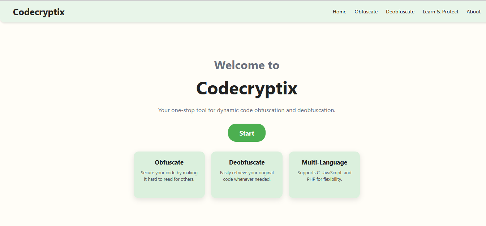

## Signup Page
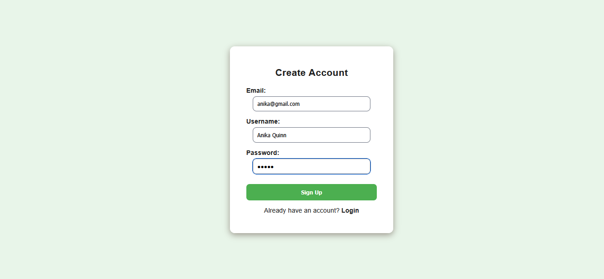  

## Login Page
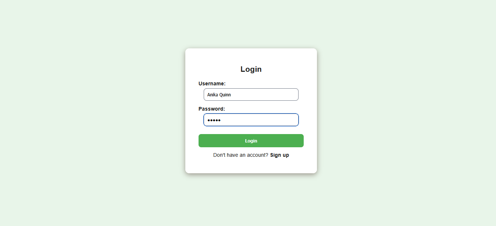

## Home Dashboard
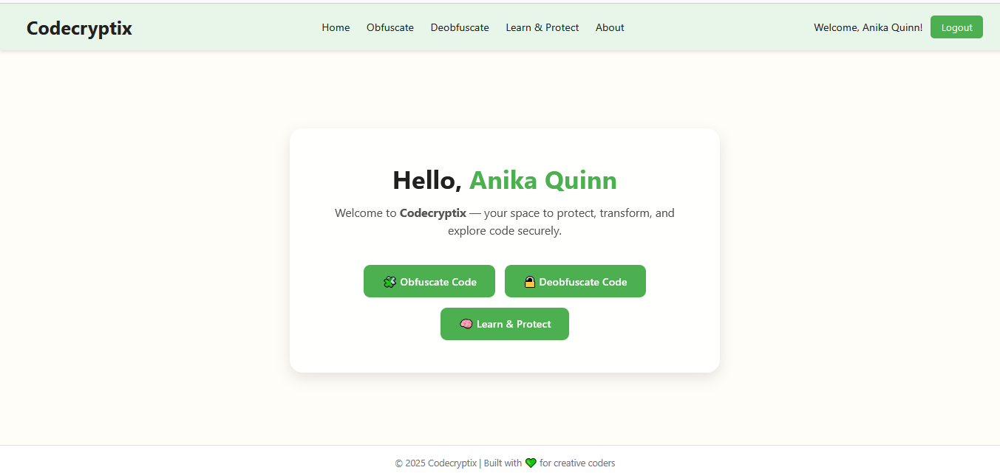

## Obfuscation Pages
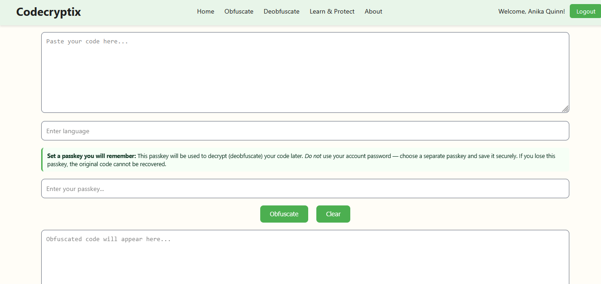
### User enters code , language and passkey to obfuscate code
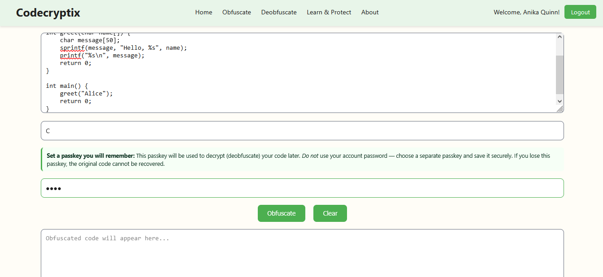
### Result
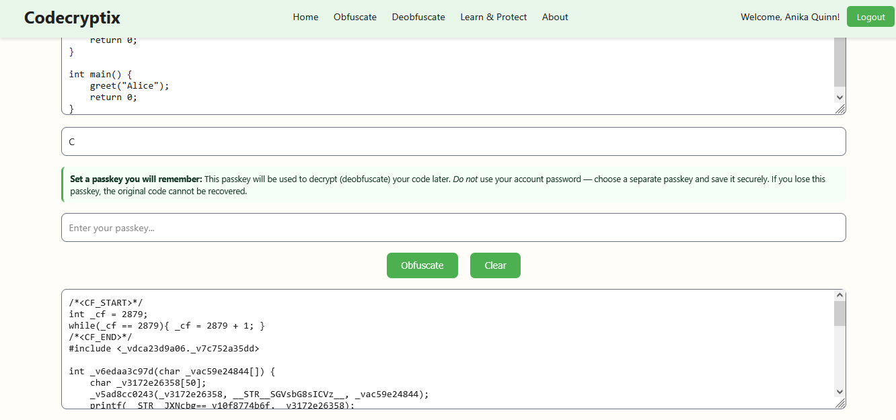

### Deobfuscation Pages
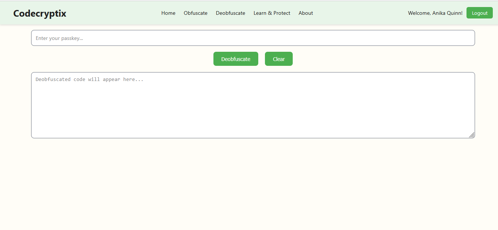
### User enters passkey to deobfuscate code
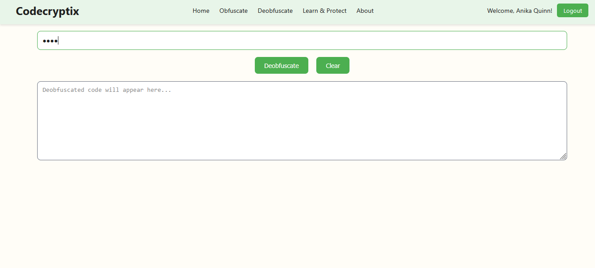
### Result
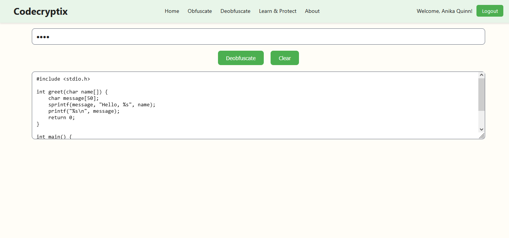

## Learn and Protect Page
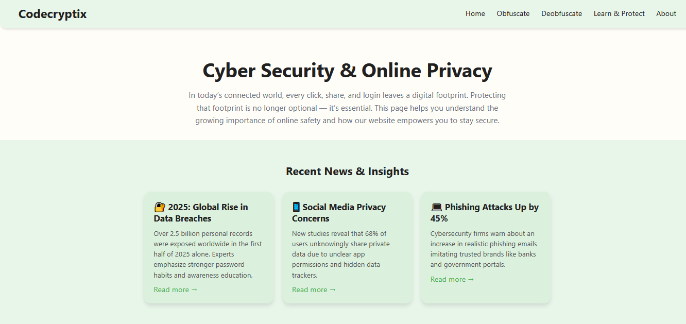
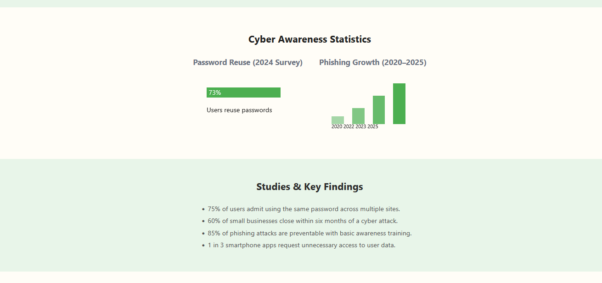
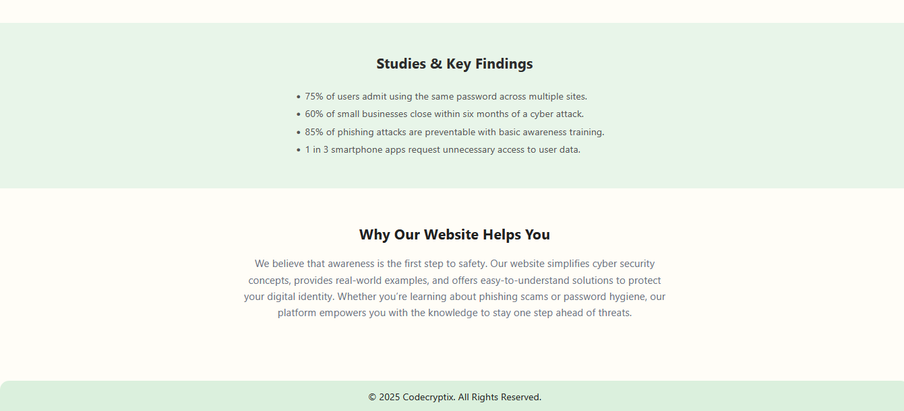

## About Page
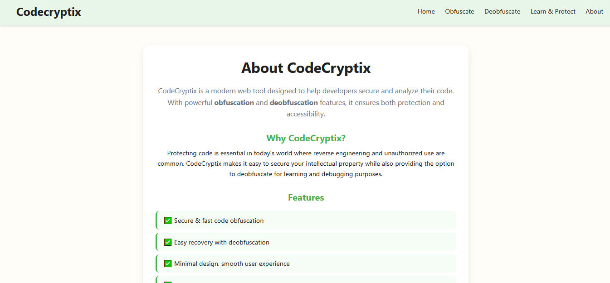
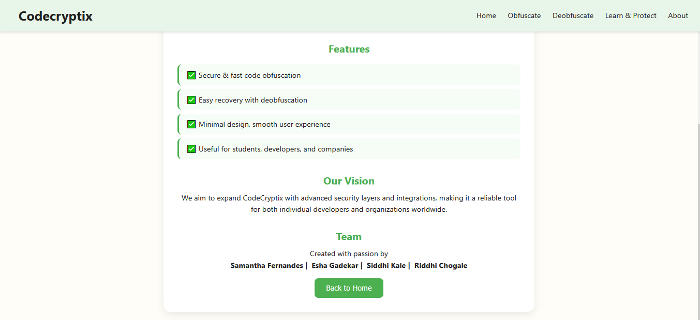


---

## Features

- Multi-language support: JavaScript, Python, C  
- Reversible obfuscation using a user-defined passkey  
- Identifier and string protection  
- Control-flow transformation and dummy function injection  
- User authentication system for secure access  
- Web-based interface for easy code input and retrieval  

---

## Tech Stack

- Frontend: HTML, CSS, JavaScript  
- Backend: PHP  
- Database: PostgreSQL  
- Server: Apache  

---

## How It Works

### Obfuscation
1. User logs into the system  
2. Inputs source code and selects language  
3. Provides a passkey  
4. Code is transformed using obfuscation techniques  
5. Obfuscated output is generated and stored  

### Deobfuscation
1. User provides the correct passkey  
2. System reverses transformations  
3. Original code is restored  

---

## Setup Requirements

- Apache server with PHP 8.x  
- PostgreSQL database  
- Import schema from `database.sql`  

---

## Sample Test Code

```javascript
function greet(name) {
    let message = "Hello, " + name;
    console.log(message);
    return message;
}

let userName = "Alice";
greet(userName);
```
---

## Project Info / Credits

**Codecryptix** is a **group project** developed collaboratively by:

- Siddhi Kale
- Esha Gadekar
- Riddhi Chogale
- Samantha Fernandes

## Project Status

This project is currently configured for local development.  
A production deployment version is planned as part of future improvements.
